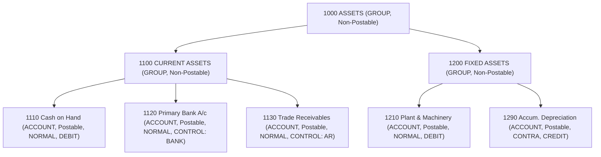

# Phase 2.2 — Chart of Accounts (COA) Architecture & Implementation Plan (Final Corrected)

## Executive Summary
Phase 2.2 defines the authoritative **Chart of Accounts (COA)** architecture for General ERP. As the financial master for all ledger accounts, the COA serves as the foundational structure for General Ledger (GL) posting, Accounts Receivable (AR), Accounts Payable (AP), GST Tax Engine, Banking/Cash management, Fixed Assets, Payroll, Expenses, and Financial Reporting (Trial Balance, P&L, Balance Sheet).

This document establishes the finalized, production-grade architecture, data models, invariants, security policies, API contracts, template instantiation engines, and verification gates for Phase 2.2. **No application source code, database tables, migrations, or services have been created in this planning phase.**

---

## 1. Current Repository Assessment
- **Phase 2.0 Foundation**: Productionized Numbering Engine, database migration pipeline (`001`, `002`, `003`), exact monetary decimal arithmetic guidelines, and PostgreSQL transaction atomicity.
- **Phase 2.1 Fiscal Periods**: Verified company-scoped `fiscal_years` and `fiscal_periods` with `assertPeriodOpen` contracts, authorization gates, and audit logging.
- **Existing Schema Baseline**: Preliminary `chart_of_accounts` table defined in `packages/database/src/schema/accounting.ts` with basic fields (`id`, `tenantId`, `companyId`, `accountCode`, `accountName`, `accountType`, `parentId`). Phase 2.2 will expand and productionize this schema via migration `004_phase2_2_coa.sql`.

---

## 2. Goals
1. Establish a unified, company-scoped hierarchical Chart of Accounts (Account Groups & Ledger Accounts).
2. Define canonical account types (`ASSET`, `LIABILITY`, `EQUITY`, `INCOME`, `EXPENSE`), account nature (`NORMAL` vs `CONTRA`), and deterministic normal balance rules (`DEBIT` vs `CREDIT`).
3. Enforce strict postable vs. non-postable rules (`nodeType = 'GROUP'` MUST have `isPostable = false`; `nodeType = 'ACCOUNT'` MUST have `isPostable = true`).
4. Implement control account metadata (`AR`, `AP`, `TAX_INPUT`, `TAX_OUTPUT`, `BANK`, `CASH`, `PAYROLL`, `INVENTORY`, `FIXED_ASSETS`) with subledger metadata consistency rules.
5. Provide zero-cycle database and service level tree protection (`A -> B -> C -> A` cycles rejected) and enforce maximum hierarchy depth of 10 levels.
6. Provide a pre-packaged, versioned, generic default Indian SME COA template (`INDIAN_SME_DEFAULT_V1`) with atomic transactional application and conflict detection.
7. Enforce post-financial-posting attribute immutability for `accountCode`, `accountType`, `accountSubtype`, `accountNature`, `normalBalance`, `parentId`, `isControlAccount`, `controlAccountType`, and `currency`.
8. Ensure strict multi-tenant and company security isolation on all queries, mutations, and API routes.
9. Support hash-chained audit logging for all COA master data modifications.

---

## 3. Non-Goals (Phase Scope Boundaries)
- **NOT in Phase 2.2**:
  - General Ledger posting pipeline or journal entry submission (Phase 2.3 & 2.4).
  - GST effective-dated tax matrix or GST return filing (Phase 2.5).
  - AR / AP subledgers, invoice matching, or open-item tracking (Phase 2.6 & 2.7).
  - Bank reconciliation or payment voucher processing (Phase 2.8).
  - Financial reporting query engine (Trial Balance / P&L / Balance Sheet generation) (Phase 2.10).
  - Operational domain integrations (Sales, Procurement, HR, Payroll).

---

## 4. Architectural Position & Responsibility Boundary
Maintaining the non-negotiable architectural dependency direction:
```text
Platform Engine Layer (Authz, Audit, Numbering, DB)
        ↓
Finance Engine Layer (Fiscal Period, COA, GL, Tax, AR, AP, Banking)
        ↓
Operational Domain Layer (Sales, Procurement, Inventory, Payroll)
```

```text
                    PLATFORM
                       │
                       ▼
                    FINANCE
                       │
             ┌─────────┴─────────┐
             ▼                   ▼
            COA                  GL
             │                   │
             │                   ├── posting enforcement
             │                   ├── journal immutability
             │                   └── transaction snapshots
             │
             ├── account master
             ├── hierarchy
             ├── classification
             ├── control metadata
             └── lifecycle
```

### Explicit Ownership Boundaries
- **Phase 2.2 COA Master**: Responsible for stable account identity, stable classification after posting, stable hierarchy after posting, control metadata declaration, and safe master-data lifecycle.
- **Future GL (Phase 2.3/2.4)**: Responsible for transaction-time account references, capturing transaction snapshots (`accountId`, `accountCode`, `accountName`), journal line immutability, and journal posting policy enforcement.
- **Future Reporting (Phase 2.10)**: Responsible for Trial Balance, P&L, and Balance Sheet aggregation and presentation.

---

## 5. Domain Model & Unified Node Architecture

To eliminate duplicate schema complexity while supporting arbitrary tree depth, Phase 2.2 adopts a **Unified Node Architecture** in a single `chart_of_accounts` table:
- **`nodeType = 'GROUP'`**: Non-postable structural header/category (e.g., `1000 ASSETS`, `1100 CURRENT ASSETS`). `isPostable` is ALWAYS `false`. Cannot be referenced by GL journal lines.
- **`nodeType = 'ACCOUNT'`**: Postable leaf ledger account (e.g., `1110 Cash on Hand`, `1130 Trade Receivables`). `isPostable` is ALWAYS `true`. Can be selected in GL journal lines.

### Strict Postability Model
```text
nodeType = 'GROUP'   ──>  isPostable = false (ALWAYS)
nodeType = 'ACCOUNT' ──>  isPostable = true  (ALWAYS)
```
There are no non-postable `ACCOUNT` nodes. `isPostable` is derived directly from `nodeType`.



---

## 6. Canonical Account Types, Account Nature & Normal Balances

The architecture enforces a strict 2-level classification:
1. **`accountType`** (Canonical 5 Categories): `ASSET`, `LIABILITY`, `EQUITY`, `INCOME`, `EXPENSE`.
2. **`accountNature`**: `NORMAL` | `CONTRA`.

### Deterministic Normal Balance Rules

| `accountType` | `accountNature` | `normalBalance` | Financial Statement | Example Accounts |
| :--- | :--- | :--- | :--- | :--- |
| **`ASSET`** | `NORMAL` | `DEBIT` | Balance Sheet | Cash, Bank, Trade Receivables, Inventory, Machinery |
| **`ASSET`** | `CONTRA` | `CREDIT` | Balance Sheet | Accumulated Depreciation, Allowance for Bad Debts |
| **`LIABILITY`** | `NORMAL` | `CREDIT` | Balance Sheet | Trade Payables, Taxes Payable, Bank Loans |
| **`LIABILITY`** | `CONTRA` | `DEBIT` | Balance Sheet | Discount on Bonds Payable, Debt Issuance Costs |
| **`EQUITY`** | `NORMAL` | `CREDIT` | Balance Sheet | Share Capital, Partner's Capital, Retained Earnings |
| **`EQUITY`** | `CONTRA` | `DEBIT` | Balance Sheet | Treasury Stock, Owner's Drawings |
| **`INCOME`** | `NORMAL` | `CREDIT` | Profit & Loss | Sales Revenue, Service Income, Interest Income |
| **`INCOME`** | `CONTRA` | `DEBIT` | Profit & Loss | Sales Returns, Sales Discounts & Allowances |
| **`EXPENSE`** | `NORMAL` | `DEBIT` | Profit & Loss | Raw Material Purchases, Salaries, Rent, Utilities |
| **`EXPENSE`** | `CONTRA` | `CREDIT` | Profit & Loss | Purchase Returns, Purchase Discounts |

---

## 7. Account Hierarchy & Cycle Protection Rules
1. **Parent-Child Relationship**: `parentId` references `chart_of_accounts.id` (`ON DELETE RESTRICT`).
2. **Database-Enforced Same Company Ownership**: Composite Foreign Key `(tenant_id, company_id, parent_id)` references `(tenant_id, company_id, id)`. This DB constraint guarantees at PostgreSQL level that a child account can NEVER reference a parent from another company or tenant.
3. **Category Consistency**: A child account's `accountType` must match its parent group's root `accountType`.
4. **Group Postability Guard**: `nodeType = 'GROUP'` MUST have `isPostable = false`.
5. **Maximum Hierarchy Depth**: Bounded to a maximum of **10 levels**. Exceeding depth 10 is rejected at domain service validation with `ValidationError("Account hierarchy depth exceeds maximum allowed limit of 10 levels")`.
6. **Cycle Prevention Strategy**:
   - Service level recursive CTE ancestor search rejects `parentId` updates if `parentId` is an ancestor of the current node (`ValidationError("Circular parent dependency detected in account hierarchy")`).
   - PostgreSQL trigger guard `check_coa_cycle()` prevents direct SQL insertion of cycles (`A -> B -> C -> A`).

---

## 8. Account Code Strategy
- **Database Capacity**: `varchar(32)` for future flexibility.
- **Domain Validation Rules**:
  - Length: 4 to 10 canonical characters.
  - Allowed Characters: Alphanumeric uppercase, digits, hyphens (`-`), underscores (`_`). No leading/trailing spaces or special symbols.
  - Case Sensitivity: UPPERCASE normalized before storage.
- **Uniqueness Scope**: `(tenantId, companyId, accountCode)` composite unique index (`idx_coa_tenant_comp_code`).
- **Code Allocation**: Manually assigned by user/template or generated using the Platform Numbering Engine if auto-sequenced. Never `MAX(code)+1`.

---

## 9. Account Lifecycle & Status Management

```text
[ DRAFT ] ──(Activate)──> [ ACTIVE ] ──(Deactivate)──> [ INACTIVE ]
                              ▲                             │
                              └───────(Re-activate)─────────┘
```

- **Single Lifecycle Field**: `status` (`DRAFT`, `ACTIVE`, `INACTIVE`) is the SOLE source of truth. (The duplicate `isActive` boolean is removed).
- **`ACTIVE`**: Account is operational and eligible for GL journal postings.
- **`INACTIVE`**: Account is disabled for new postings. Existing historical journal entries retain referential integrity.
- **Strict Account Deletion Policy**:
  - An account may be physically deleted (`DELETE`) ONLY IF ALL of the following criteria are met:
    1. No posted financial transactions exist in GL.
    2. No child accounts or child groups exist (`parentId` references).
    3. No protected system configuration references it (e.g., Default Retained Earnings, Default Tax account).
    4. No active control account or subledger configuration references it.
    5. No other protected record references it.
  - If any of these conditions fail, physical deletion is REJECTED with `BusinessRuleViolationError`. The user must deactivate the account (`ACTIVE -> INACTIVE`) instead.

---

## 10. Control Accounts & Subledger Integration Boundary

Control accounts represent summary ledger balances owned by operational subledgers:
- **Canonical `controlAccountType` Classifications**:
  - `AR`: Accounts Receivable (Trade Debtors)
  - `AP`: Accounts Payable (Trade Creditors)
  - `TAX_INPUT`: GST / Statutory Input Tax Credit
  - `TAX_OUTPUT`: GST / Statutory Output Tax Payable
  - `CASH`: Physical Cash Balance
  - `BANK`: Bank Account Balance
  - `PAYROLL`: Salaries & Payroll Payable
  - `INVENTORY`: Inventory Stock Valuation
  - `FIXED_ASSETS`: Fixed Assets Subledger
- **Metadata Consistency Invariants**:
  - `isControlAccount = false` ──> `controlAccountType` MUST be `NULL`.
  - `isControlAccount = true`  ──> `controlAccountType` MUST be a valid canonical type.
  - `controlAccountType` is **NOT globally unique**: Multiple accounts may legitimately share the same control type (e.g., multiple bank accounts assigned `BANK`, or CGST/SGST/IGST accounts assigned `TAX_INPUT`).
- **Subledger Ownership Boundary**:
  - COA declares control account metadata (`isControlAccount: boolean`, `controlAccountType: string`).
  - **Posting Policy Ownership belongs to GL**: Future GL posting pipeline evaluates whether a caller is an approved subledger module or holds elevated GL posting permissions. COA does not execute posting authorization.

---

## 11. Attribute Immutability Matrix & Historical Protection

To guarantee complete financial reporting integrity, COA attributes become strictly immutable after the first posted financial transaction exists:

### Account Attribute Immutability Matrix

| Attribute | Before Posted Usage | After Posted Usage | Rationale for Post-Posting Immutability |
| :--- | :--- | :--- | :--- |
| `accountCode` | Editable | **Immutable** | Preserves historical ledger reference & audit trail |
| `accountName` | Editable | **Editable** | Safe display name clarification |
| `accountType` | Editable | **Immutable** | Prevents breaking Balance Sheet vs P&L classification |
| `accountSubtype` | Editable | **Immutable** | Prevents breaking current vs fixed asset / COGS grouping |
| `accountNature` | Editable | **Immutable** | Prevents flipping DEBIT/CREDIT interpretation |
| `normalBalance` | Editable | **Immutable** | Prevents invalidating historical debit/credit balances |
| `nodeType` | Controlled | **Immutable** | Prevents converting postable account to group node |
| `isPostable` | Derived | **Immutable** | Derived from nodeType; preserves posting capability |
| `parentId` | Editable | **Immutable** | Prevents changing hierarchy path & statement aggregation |
| `isControlAccount` | Editable | **Immutable** | Preserves subledger control classification |
| `controlAccountType`| Editable | **Immutable** | Preserves subledger mapping identity |
| `currency` | Controlled | **Immutable** | Preserves currency valuation context |
| `displayOrder` | Editable | **Editable** | Safe UI display ordering change |
| `status` | Controlled (`DRAFT`/`ACTIVE`/`INACTIVE`) | Controlled (`ACTIVE`/`INACTIVE`) | Account may be disabled (`INACTIVE`), never reactivated to DRAFT |

---

## 12. Currency Policy & Company Base Currency Rule
- Database Column: `currency: varchar('currency', { length: 3 })` (Nullable).
- Inheritance Semantics:
  - `NULL`: Dynamically inherits current company base currency (e.g., `INR`).
  - Explicit Currency Code (e.g., `'USD'`, `'EUR'`): Foreign-currency enabled account.
- **Company Base Currency Immutability Rule**: Company base currency MUST NOT be changed after the company has posted financial transactions. Therefore, `NULL` account currency remains completely safe and unambiguous across historical periods.

---

## 13. Default Indian SME COA Template (`INDIAN_SME_DEFAULT_V1`)

Phase 2.2 provides a pre-packaged, versioned, generic default template that can be instantiated with one click when onboarding a new company:

```text
1000 ASSETS [GROUP]
├── 1100 CURRENT ASSETS [GROUP]
│   ├── 1110 Cash on Hand [ACCOUNT, NORMAL, CASH]
│   ├── 1120 Primary Bank Account [ACCOUNT, NORMAL, BANK]
│   ├── 1130 Trade Receivables [ACCOUNT, NORMAL, CONTROL: AR]
│   ├── 1140 CGST Input Tax Credit [ACCOUNT, NORMAL, CONTROL: TAX_INPUT]
│   ├── 1141 SGST Input Tax Credit [ACCOUNT, NORMAL, CONTROL: TAX_INPUT]
│   ├── 1142 IGST Input Tax Credit [ACCOUNT, NORMAL, CONTROL: TAX_INPUT]
│   └── 1150 Prepaid Expenses & Advances [ACCOUNT, NORMAL]
└── 1200 NON-CURRENT ASSETS [GROUP]
    ├── 1210 Plant & Machinery [ACCOUNT, NORMAL]
    ├── 1220 Computers & IT Equipment [ACCOUNT, NORMAL]
    └── 1290 Accumulated Depreciation [ACCOUNT, CONTRA, CREDIT]

2000 LIABILITIES [GROUP]
├── 2100 CURRENT LIABILITIES [GROUP]
│   ├── 2110 Trade Payables [ACCOUNT, NORMAL, CONTROL: AP]
│   ├── 2120 CGST Output Tax Payable [ACCOUNT, NORMAL, CONTROL: TAX_OUTPUT]
│   ├── 2121 SGST Output Tax Payable [ACCOUNT, NORMAL, CONTROL: TAX_OUTPUT]
│   ├── 2122 IGST Output Tax Payable [ACCOUNT, NORMAL, CONTROL: TAX_OUTPUT]
│   ├── 2130 TDS Payable [ACCOUNT, NORMAL]
│   └── 2140 Salary & Wages Payable [ACCOUNT, NORMAL, CONTROL: PAYROLL]
└── 2200 NON-CURRENT LIABILITIES [GROUP]
    └── 2210 Bank Term Loans [ACCOUNT, NORMAL]

3000 EQUITY [GROUP]
├── 3100 Owner's / Partner's Capital [ACCOUNT, NORMAL]
└── 3200 Retained Earnings [ACCOUNT, NORMAL]

4000 REVENUE [GROUP]
├── 4100 Sales Revenue - Domestic [ACCOUNT, NORMAL]
├── 4110 Sales Revenue - Export [ACCOUNT, NORMAL]
├── 4190 Sales Returns & Allowances [ACCOUNT, CONTRA, DEBIT]
└── 4200 Other Operating Income [ACCOUNT, NORMAL]

5000 EXPENSES [GROUP]
├── 5100 COST OF GOODS SOLD (COGS) [GROUP]
│   ├── 5110 Raw Material Purchases [ACCOUNT, NORMAL]
│   └── 5120 Freight Inward & Customs [ACCOUNT, NORMAL]
└── 5200 INDIRECT OPERATING EXPENSES [GROUP]
    ├── 5210 Salaries & Employee Benefits [ACCOUNT, NORMAL]
    ├── 5220 Office Rent & Maintenance [ACCOUNT, NORMAL]
    ├── 5230 Electricity & Utilities [ACCOUNT, NORMAL]
    ├── 5240 Legal & Professional Fees [ACCOUNT, NORMAL]
    ├── 5250 Audit Fees [ACCOUNT, NORMAL]
    └── 5260 Bank Charges & Gateway Fees [ACCOUNT, NORMAL]
```

### Template Engine Governance & Conflict Policy
- **Template Immutability**: Templates are versioned and immutable (`templateId: 'INDIAN_SME_DEFAULT_V1'`). Revisions create `INDIAN_SME_DEFAULT_V2`.
- **Matching Key**: Matching key for existing account evaluation is `(tenantId, companyId, accountCode)` after canonical normalization. Template account keys (`templateAccountKey` e.g., `TRADE_RECEIVABLES`) are metadata in the template definition and NOT persisted as company account UUIDs.
- **Transactional Instantiation & Conflict Behavior**:
  - Template application runs inside a single database transaction (`db.transaction(...)`).
  - **Case A (Code does not exist)**: Create account.
  - **Case B (Matching code exists with identical classification)**: Preserve existing account, skip creation (idempotent success).
  - **Case C (Matching code exists with conflicting classification, e.g. existing `1130` is `LIABILITY` while template expects `ASSET`)**: Structural conflict detected ──> Entire template application transaction **FAILS and ROLLS BACK atomically**. A structured conflict report is returned.

---

## 14. Governance, Authorization & Audit

### Authorization Permissions
- `finance:coa:read`: View Chart of Accounts tree and account details.
- `finance:coa:create`: Create new account groups or ledger accounts.
- `finance:coa:update`: Edit account names, descriptions, or sub-types.
- `finance:coa:activate`: Activate draft or inactive accounts.
- `finance:coa:deactivate`: Deactivate active accounts.
- `finance:coa:admin`: Administer templates or delete unused accounts.

### Audit Engine Events
- `finance::ChartOfAccounts::CREATE`
- `finance::ChartOfAccounts::UPDATE`
- `finance::ChartOfAccounts::ACTIVATED`
- `finance::ChartOfAccounts::DEACTIVATED`
- `finance::ChartOfAccounts::TEMPLATE_APPLY`

---

## 15. Database Schema Proposal (`004_phase2_2_coa.sql`)

```typescript
export const chartOfAccounts = pgTable('chart_of_accounts', {
  id: uuid('id').primaryKey().defaultRandom(),
  tenantId: varchar('tenant_id', { length: 64 }).notNull(),
  companyId: uuid('company_id').notNull().references(() => companies.id, { onDelete: 'restrict' }),
  accountCode: varchar('account_code', { length: 32 }).notNull(),
  accountName: varchar('account_name', { length: 128 }).notNull(),
  nodeType: varchar('node_type', { length: 16 }).notNull().default('ACCOUNT'), // 'GROUP', 'ACCOUNT'
  accountType: varchar('account_type', { length: 32 }).notNull(), // 'ASSET', 'LIABILITY', 'EQUITY', 'INCOME', 'EXPENSE'
  accountSubtype: varchar('account_subtype', { length: 64 }),    // 'CURRENT_ASSET', 'FIXED_ASSET', 'COGS', etc.
  accountNature: varchar('account_nature', { length: 16 }).notNull().default('NORMAL'), // 'NORMAL', 'CONTRA'
  normalBalance: varchar('normal_balance', { length: 8 }).notNull(), // 'DEBIT', 'CREDIT'
  parentId: uuid('parent_id'),
  isPostable: boolean('is_postable').notNull().default(true),
  isControlAccount: boolean('is_control_account').notNull().default(false),
  controlAccountType: varchar('control_account_type', { length: 32 }), // 'AR', 'AP', 'TAX_INPUT', 'TAX_OUTPUT', 'CASH', 'BANK', 'PAYROLL', 'INVENTORY', 'FIXED_ASSETS'
  currency: varchar('currency', { length: 3 }), // NULL = inherit company base currency
  status: varchar('status', { length: 16 }).notNull().default('ACTIVE'), // 'DRAFT', 'ACTIVE', 'INACTIVE'
  displayOrder: integer('display_order').notNull().default(0),
  version: integer('version').notNull().default(1),
  createdAt: timestamp('created_at', { withTimezone: true }).notNull().defaultNow(),
  updatedAt: timestamp('updated_at', { withTimezone: true }).notNull().defaultNow()
}, (table) => ({
  tenantCompIdIdx: uniqueIndex('idx_coa_tenant_comp_id').on(table.tenantId, table.companyId, table.id),
  tenantCompCodeIdx: uniqueIndex('idx_coa_tenant_comp_code').on(table.tenantId, table.companyId, table.accountCode),
  tenantCompParentFk: foreignKey({
    columns: [table.tenantId, table.companyId, table.parentId],
    foreignColumns: [table.tenantId, table.companyId, table.id]
  }).onDelete('restrict'),
  tenantCompParentIdx: index('idx_coa_tenant_comp_parent').on(table.tenantId, table.companyId, table.parentId),
  tenantCompTypeIdx: index('idx_coa_tenant_comp_type').on(table.tenantId, table.companyId, table.accountType)
}));
```

---

## 16. API Contract (`/api/v1/finance/coa`)

1. `GET /api/v1/finance/coa/tree?companyId=...`
   - Returns hierarchical nested COA tree for UI tree-view components.
2. `GET /api/v1/finance/coa/accounts?companyId=...&type=ASSET&isPostable=true`
   - Returns flat list of postable accounts for dropdown selection in journal entries.
3. `GET /api/v1/finance/coa/accounts/:id`
   - Returns single account details.
4. `POST /api/v1/finance/coa/accounts`
   - Create new group or ledger account.
5. `PATCH /api/v1/finance/coa/accounts/:id`
   - Edit account metadata (name, displayOrder). Rejects modification of immutable attributes if posted transactions exist.
6. `POST /api/v1/finance/coa/accounts/:id/activate`
   - Activate account (`status = 'ACTIVE'`).
7. `POST /api/v1/finance/coa/accounts/:id/deactivate`
   - Deactivate account (`status = 'INACTIVE'`).
8. `POST /api/v1/finance/coa/templates/apply`
   - Instantiate pre-packaged COA template (`INDIAN_SME_DEFAULT_V1`) for a company.

---

## 17. Future GL Eligibility Contract

Phase 2.3 General Ledger posting pipeline will query `chartOfAccounts` service using:
```typescript
interface GLAccountEligibility {
  accountId: string;
  accountCode: string;
  accountName: string;
  accountType: 'ASSET' | 'LIABILITY' | 'EQUITY' | 'INCOME' | 'EXPENSE';
  accountSubtype?: string;
  accountNature: 'NORMAL' | 'CONTRA';
  normalBalance: 'DEBIT' | 'CREDIT';
  nodeType: 'GROUP' | 'ACCOUNT';
  isPostable: boolean;
  status: 'DRAFT' | 'ACTIVE' | 'INACTIVE';
  isEligibleForPosting: boolean;
  ineligibilityReason?: string;
  isControlAccount: boolean;
  controlAccountType?: string;
  companyId: string;
  currency?: string;
}
```
Validation rules evaluated by GL:
1. `account.status === 'ACTIVE'`
2. `account.nodeType === 'ACCOUNT'` and `account.isPostable === true`
3. `account.tenantId === ctx.tenantId` and `account.companyId === ctx.companyId`
4. If `account.isControlAccount === true`, verify caller is an authorized subledger module or holds GL direct control posting permission.

---

## 18. Complete Invariant Matrix (33 Items)

| # | Invariant Description | Enforcement Layer |
| :--- | :--- | :--- |
| 1 | Account belongs to exactly one `tenantId`. | DB Scoped Column + Query Guard |
| 2 | Account belongs to exactly one `companyId`. | DB Scoped Column + Query Guard |
| 3 | `accountCode` is unique per company scope `(tenantId, companyId, accountCode)`. | DB Composite Unique Index |
| 4 | `accountCode` is canonical uppercase alphanumeric (4-10 chars, no leading/trailing spaces). | Service Validation |
| 5 | Parent account MUST belong to the exact same `(tenantId, companyId)`. | DB Composite Foreign Key |
| 6 | Parent cannot be self (`parentId !== id`). | Service + DB Check Constraint |
| 7 | Circular hierarchy (`A -> B -> C -> A`) is strictly impossible. | Service Recursive CTE + DB Trigger |
| 8 | Maximum hierarchy depth is bounded to 10 levels. | Service Tree Builder Validation |
| 9 | `nodeType = 'GROUP'` accounts MUST have `isPostable = false`. | Service + DB Check Constraint |
| 10 | `nodeType = 'ACCOUNT'` accounts MUST have `isPostable = true`. | Service + DB Check Constraint |
| 11 | `accountType` MUST be one of 5 canonical categories (`ASSET`, `LIABILITY`, `EQUITY`, `INCOME`, `EXPENSE`). | Service + DB Check Constraint |
| 12 | `accountNature` MUST be `NORMAL` or `CONTRA`. | Service + DB Check Constraint |
| 13 | Normal balance is deterministic (`NORMAL`: ASSET/EXPENSE=DEBIT, LIABILITY/EQUITY/INCOME=CREDIT; `CONTRA`: Inverse). | Service Validation |
| 14 | Account status MUST be `DRAFT`, `ACTIVE`, or `INACTIVE` (single source of truth). | Service + DB Check Constraint |
| 15 | Accounts with historical posted transactions or structural/configuration dependencies CANNOT be physically deleted. | Service Deletion Guard |
| 16 | `accountCode` is IMMUTABLE after posted transactions exist. | Service Mutation Guard |
| 17 | `accountType` is IMMUTABLE after posted transactions exist. | Service Mutation Guard |
| 18 | `accountSubtype` is IMMUTABLE after posted transactions exist. | Service Mutation Guard |
| 19 | `accountNature` is IMMUTABLE after posted transactions exist. | Service Mutation Guard |
| 20 | `normalBalance` is IMMUTABLE after posted transactions exist. | Service Mutation Guard |
| 21 | `parentId` hierarchy is IMMUTABLE after posted transactions exist. | Service Mutation Guard |
| 22 | `isControlAccount` & `controlAccountType` are IMMUTABLE after posted transactions exist. | Service Mutation Guard |
| 23 | `currency` is IMMUTABLE after posted transactions exist. | Service Mutation Guard |
| 24 | Cross-tenant access is rejected with `NotFoundError`. | Tenant Context Filter |
| 25 | Cross-company access is rejected with `NotFoundError`. | Company Context Filter |
| 26 | If `isControlAccount = false`, `controlAccountType` MUST be `NULL`. If `isControlAccount = true`, `controlAccountType` MUST be valid. | Service + DB Check Constraint |
| 27 | Template definitions are versioned and immutable (`INDIAN_SME_DEFAULT_V1`). | Template Engine |
| 28 | Template application runs in a single atomic database transaction (`db.transaction(...)`). | Template Engine |
| 29 | Re-applying a matching template to a company is idempotent and skips existing codes. | Template Engine |
| 30 | Re-applying a template with structural category conflicts rolls back the transaction atomically. | Template Engine |
| 31 | Concurrent creation of accounts with identical codes for the same company yields 1 success and N-1 DB unique index rejections. | PostgreSQL Unique Index |
| 32 | Future GL eligibility contract accurately evaluates `status`, `nodeType`, `isPostable`, and company scope. | GL Eligibility Contract |
| 33 | Historical financial reporting integrity is guaranteed across master account changes via post-posting attribute immutability and GL transaction snapshots. | COA/GL Contract Boundary |

---

## 19. Decided Architecture Summary

All architectural choices are finalized. **Remaining Architectural Decisions: NONE.**

1. **Table Design**: Single Unified Table (`chart_of_accounts` with `nodeType`).
2. **Control Account Metadata**: COA declares metadata; GL enforces subledger posting policy.
3. **Currency Inheritance**: Nullable `currency` column (`NULL` = inherit company base currency).
4. **Account Nature & Normal Balance**: Canonical `accountType` (5 categories) + `accountNature` (`NORMAL` / `CONTRA`).
5. **Single Status Field**: `status` (`DRAFT`, `ACTIVE`, `INACTIVE`) is the sole lifecycle field.
6. **Strict Postability**: `nodeType = 'GROUP'` (non-postable) vs `nodeType = 'ACCOUNT'` (postable).
7. **Post-Posting Immutability**: All classification attributes (`accountCode`, `accountType`, `accountSubtype`, `accountNature`, `normalBalance`, `parentId`, `isControlAccount`, `controlAccountType`, `currency`) become strictly immutable after posting.
8. **Transactional Template Engine**: Instantiation runs inside an atomic DB transaction with structured conflict detection.

---

## 20. Implementation Sub-Phases (Execution Roadmap)

```text
Sub-phase 2.2.0: Migration 004_phase2_2_coa.sql & Drizzle Schema Update
Sub-phase 2.2.1: COA Domain Model & Hierarchy Service
Sub-phase 2.2.2: Composite DB FK & CTE Cycle Prevention Guards
Sub-phase 2.2.3: Control Account Metadata & GL Eligibility Contracts
Sub-phase 2.2.4: Versioned Indian SME COA Template Engine
Sub-phase 2.2.5: Authorization & Hash-Chained Audit Trail Integration
Sub-phase 2.2.6: Fastify REST API Routes (/api/v1/finance/coa)
Sub-phase 2.2.7: Comprehensive Unit, Integration, Multi-Tenant, & Concurrency Tests
Sub-phase 2.2.8: Final Phase 2.2 Verification Gate & Completion Report
```

---

## 21. Definition of Done
Phase 2.2 will be complete only when:
1. Migration `004_phase2_2_coa.sql` applies cleanly on top of Phase 2.1 database.
2. `ChartOfAccountsService` and REST APIs provide complete tree management, account creation, activation/deactivation, and template instantiation.
3. All 33 invariants are tested and passing in automated test suite with 100% pass rate.
4. Multi-tenant and company isolation security tests pass.
5. 100-request concurrency safety is verified.
6. `docs/PHASE_2_2_COMPLETION_REPORT.md` is produced.
7. Architectural dependency boundary test passes with zero violations.

---

## 22. Confirmation of Non-Implementation
**CONFIRMED**: Zero source code, database migrations, application tables, API routes, seed scripts, or business logic implementations were created during this final architecture correction phase. Implementation awaits explicit user authorization.
